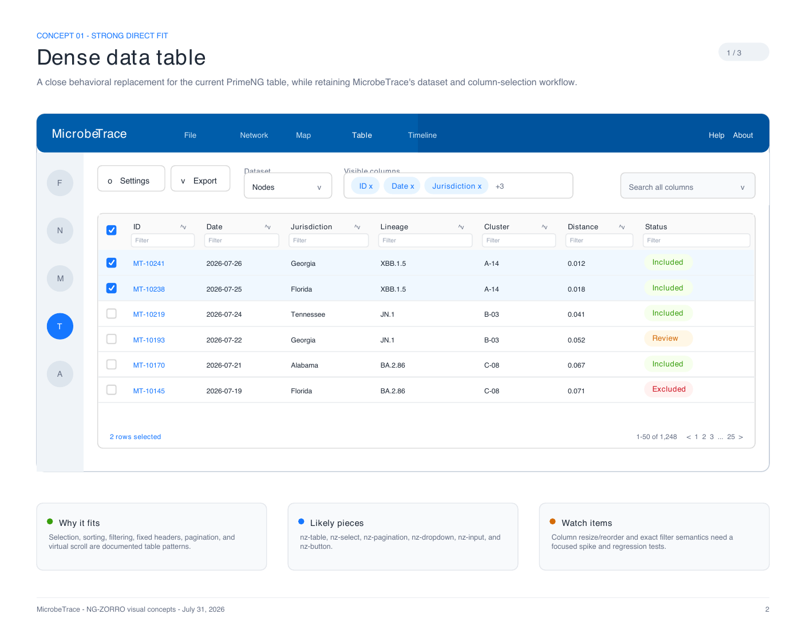
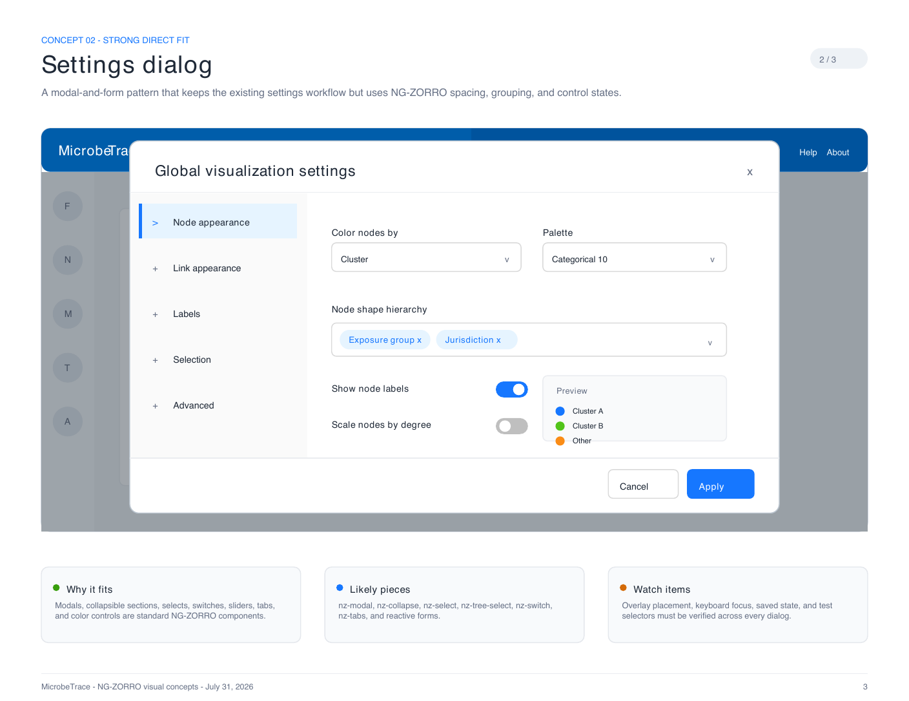
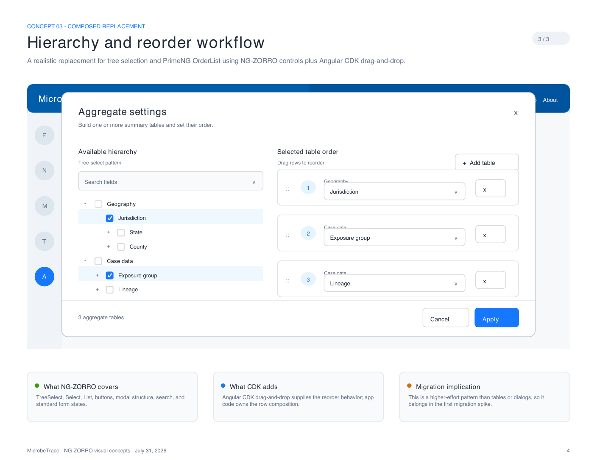

# NG-ZORRO UI Concepts for MicrobeTrace

These three illustrative concepts show how representative PrimeNG-heavy workflows could look after a move to NG-ZORRO. They are visual references, not screenshots of an implemented migration.

The examples intentionally preserve MicrobeTrace's current blue application chrome and workflow structure. The goal is to show a component refresh rather than propose a broader redesign.

## 1. Dense data table

Likely components: `nz-table`, `nz-select`, `nz-pagination`, `nz-dropdown`, `nz-input`, and `nz-button`.

- Strong direct fit for selection, sorting, filtering, fixed headers, pagination, and virtual scrolling.
- A migration spike should validate column resizing/reordering and the current filter semantics.

## 2. Settings dialog

Likely components: `nz-modal`, `nz-collapse`, `nz-select`, `nz-tree-select`, `nz-switch`, `nz-tabs`, and Angular reactive forms.

- Strong direct fit for the modal-and-form pattern used throughout MicrobeTrace.
- Overlay placement, keyboard focus, persisted state, and test selectors need regression coverage.

## 3. Hierarchy and reorder workflow

Likely components: `nz-tree-select`, `nz-list`, `nz-select`, `nz-modal`, and Angular CDK drag-and-drop.

- NG-ZORRO covers most controls and layout.
- PrimeNG `OrderList` is not a one-for-one replacement; the app would own more composition and use the Angular CDK for reorder behavior.
- This pattern should be included in the first migration spike because it is more representative of the harder replacements.

## Overall impression

The user-visible change can be moderate rather than dramatic. Tables and dialogs can remain familiar while adopting Ant Design spacing, states, and accessibility behavior. The largest effort is not the visual layer; it is preserving edge-case behavior and automated-test contracts for composed controls such as reorder lists and tree selectors.

## References

- [NG-ZORRO Table](https://ng.ant.design/components/table/en)
- [NG-ZORRO Modal](https://ng.ant.design/components/modal/en)
- [NG-ZORRO Collapse](https://ng.ant.design/components/collapse/en)
- [NG-ZORRO TreeSelect](https://ng.ant.design/components/tree-select/en)
- [NG-ZORRO Transfer](https://ng.ant.design/components/transfer/en)

The print-ready version is available as `output/pdf/ng-zorro-ui-concepts.pdf`.
