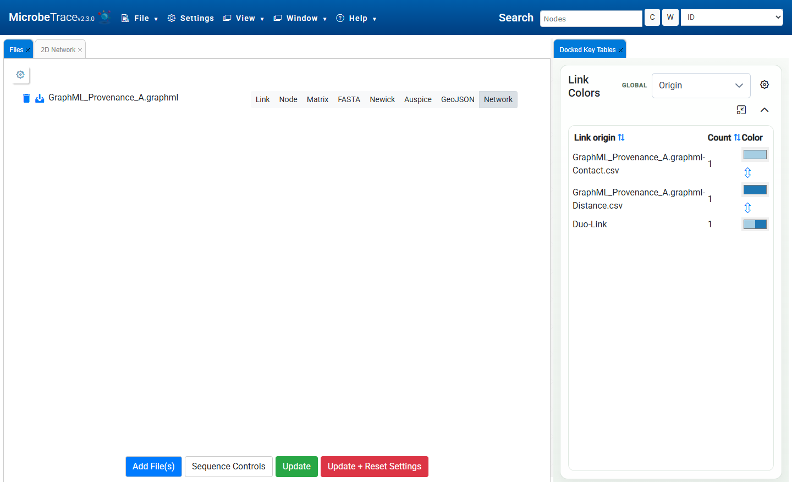
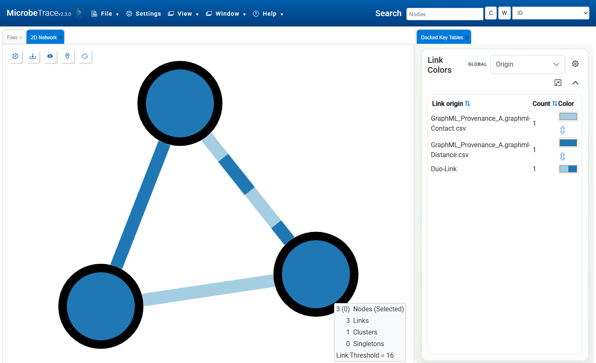
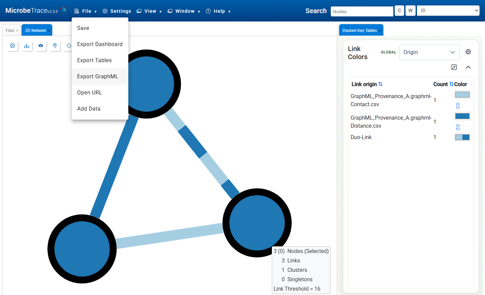

## Importing and exporting network files in MicrobeTrace

:warning: **Feature in development:** This feature is available on the [MicrobeTrace development site](https://cdcgov.github.io/MicrobeTrace) and is not yet available on the [main MicrobeTrace site](https://microbetrace.cdc.gov/MicrobeTrace).

Network files store nodes and links together in one file. MicrobeTrace can use these files to support three common tasks:

1. Load a complete network without preparing separate node and link files.
2. Preserve common node, link, graph, distance, direction, and network-origin fields.
3. Exchange network data with tools that support GraphML, GEXF, XGMML, CX2, DOT, or GML.

### Supported formats

| Format | Common extension(s) | Import | Export | Notes |
| --- | --- | --- | --- | --- |
| GraphML | `.graphml` | Yes | Yes | Recommended format for exchanging a MicrobeTrace network with other applications. |
| GEXF | `.gexf` | Yes | No | Commonly used by Gephi. Static topology and attributes are imported. |
| XGMML | `.xgmml` | Yes | No | Commonly used by Cytoscape. Topology, attributes, direction, coordinates, and graphics metadata are imported. |
| CX2 | `.cx`, `.cx2` | Yes | No | Cytoscape Exchange format. Nodes, edges, attributes, coordinates, and supported provenance fields are imported. |
| DOT | `.dot`, `.gv` | Yes | No | Graphviz network format. Basic topology, attributes, direction, and subgraphs are imported. |
| GML | `.gml` | Yes | No | Graph Modelling Language. Topology, attributes, direction, and weights are imported. |

All supported imports appear as the **Network** file type on the **Files** tab.

### Use case 1: Import a complete network

Use this workflow when one supported file contains both the nodes and the links you want to analyze.

#### Before you begin

- Each node should have a unique ID.
- Each edge should identify its source and target node.
- MicrobeTrace recognizes common numeric link fields such as `distance`, `length`, `weight`, `SNPs`, and `TN93` as distance values.
- If an edge refers to an undeclared node, MicrobeTrace creates the missing endpoint node and displays an import warning.
- Complex or presentation-specific features may be preserved as data fields rather than applied as MicrobeTrace behavior or styling.

#### Steps

1. Open the **Files** tab.
2. Select **Add File(s)** and choose a supported network file. You can also drag the file onto the Files panel.
3. Confirm that the file type is **Network**. If the file was not detected correctly, select **Network** manually.
4. Select **Launch** for a new dataset. If a dataset is already open, select **Update** to retain the current settings or **Update + Reset Settings** to return the settings to their defaults.
5. If a **Network Import Warnings** dialog appears, review the listed features and select **Confirm** to continue with the supported data.
6. Open **2D Network**, **Table**, or another compatible view to inspect and analyze the imported network.

MicrobeTrace imports the network topology and exposes supported node and link attributes as fields. Format-specific metadata is given readable names such as **GraphML Node ID**, **GEXF File**, or **XGMML Graph ID** so that it can be inspected or used in visualization controls.

When multiple network files are imported, MicrobeTrace includes the source filename in each link's origin. This keeps similarly named networks from different files separate.

#### Example files

- [Download an example GraphML file](https://raw.githubusercontent.com/CDCgov/MicrobeTrace/refs/heads/dev/cypress/fixtures/GraphML_Provenance_A.graphml) (Right-click to save)
- [Download an example GEXF file](https://raw.githubusercontent.com/CDCgov/MicrobeTrace/refs/heads/dev/cypress/fixtures/GEXF_Static_Network.gexf) (Right-click to save)
- [Download an example XGMML file](https://raw.githubusercontent.com/CDCgov/MicrobeTrace/refs/heads/dev/cypress/fixtures/XGMML_Static_Network.xgmml) (Right-click to save)
- [Download an example CX2 file](https://raw.githubusercontent.com/CDCgov/MicrobeTrace/refs/heads/dev/cypress/fixtures/CX2_Static_Network.cx2) (Right-click to save)
- [Download an example DOT file](https://raw.githubusercontent.com/CDCgov/MicrobeTrace/refs/heads/dev/cypress/fixtures/DOT_Static_Network.dot) (Right-click to save)
- [Download an example GML file](https://raw.githubusercontent.com/CDCgov/MicrobeTrace/refs/heads/dev/cypress/fixtures/GML_Static_Network.gml) (Right-click to save)

### Use case 2: Exchange a network with Cytoscape or Gephi

Use a supported network format when you want to continue working with the same topology and attributes in another network-analysis application.

#### Import into MicrobeTrace

1. Export the network from the other application in a supported format. GraphML is the most portable choice; MicrobeTrace also accepts GEXF, XGMML, CX2, DOT, and GML.
2. In MicrobeTrace, open the **Files** tab and select **Add File(s)**.
3. Confirm that the imported file is classified as **Network**, then select **Launch** or **Update**.
4. Review any import warnings. Layout, hierarchy, timing, or styling information may be available as fields even when MicrobeTrace does not apply the originating application's behavior automatically.

#### Send a MicrobeTrace network to another application

1. Load or create the network in MicrobeTrace.
2. Select **File > Export GraphML**.
3. Open the downloaded `microbetrace.graphml` file in an application that supports GraphML.

GraphML export is the outbound exchange format. GEXF, XGMML, CX2, DOT, and GML are currently import-only.

### Use case 3: Export the current dataset as GraphML

Use GraphML export when you want a single, standards-based file containing the current MicrobeTrace nodes, links, and their data fields.

#### Steps

1. Load and analyze the dataset in MicrobeTrace.
2. Select **File > Export GraphML**.
3. Save the generated `microbetrace.graphml` file.

The exported file contains:

- All nodes and links in the current dataset.
- Node and link data fields, including direction and distance information.
- Network origins and multi-network provenance.
- Graph metadata, including the export time, node count, link count, network count, selected distance metric, and link threshold.
- XML-safe GraphML element IDs. Original MicrobeTrace IDs remain available as data fields.

GraphML export preserves the network data, but it is not a complete MicrobeTrace session backup. To preserve open views, detailed view settings, and the full application state, also save a `.microbetrace` session file.

### Import behavior and limitations

- **GraphML:** Top-level graphs, nodes, edges, typed attributes, edge direction, distance fields, and provenance are imported. Nested graphs, ports, and hyperedges are not supported and are ignored with a warning.
- **GEXF:** Static topology, typed attributes, edge direction, labels, and weights are imported. Dynamic timing, hierarchy, and visualization metadata are preserved as fields, but MicrobeTrace does not automatically apply the corresponding timeline, hierarchy, or styling behavior.
- **XGMML:** Topology, attributes, edge direction, coordinates, and graphics metadata are imported. Nested graphs are ignored with a warning.
- **CX2:** Supported nodes, edges, attributes, aliases, default values, coordinates, visual bypass data, and provenance are imported. File fragments are combined in order. Unsupported opaque aspects are ignored with a warning.
- **DOT and GML:** Common topology, scalar attributes, direction, and weights are imported. Application-specific extensions may not be interpreted.

Warnings do not necessarily mean that the import failed. They identify data that was generated, ignored, or preserved only as fields. Inspect the resulting network and the imported fields before continuing an analysis.

### Helpful controls

- **Update** reloads the files while retaining the current visualization settings.
- **Update + Reset Settings** reloads the files and restores default settings.
- **Table View** can be used to inspect imported node and link attributes.
- The link threshold may hide imported links whose distance is above the current threshold. Adjust the threshold in **Settings** if expected links are missing.
- Save a `.microbetrace` file when you need a restorable MicrobeTrace session; use GraphML when you need an interoperable network file.

### Quick troubleshooting

- **The file is not recognized as a network:** Confirm that the extension is supported and select **Network** as the file type. For XML or JSON formats, also confirm that the document is valid and has the expected root structure.
- **An import warning appears:** Read the warning to see whether MicrobeTrace generated missing endpoint nodes, ignored an unsupported structure, or retained optional metadata only as fields.
- **Expected links are missing from a view:** Check the link threshold and the imported distance or weight field. Also confirm that every edge has valid source and target IDs.
- **The imported layout or colors look different:** External coordinates and styling metadata may be retained as fields without being applied automatically. Configure the desired layout and styling in the MicrobeTrace view.
- **The exported GraphML does not restore the full interface:** GraphML is a network-data exchange format. Use a `.microbetrace` session file to preserve the complete MicrobeTrace application state.

For implementation history and design context, see [Import and Export of GRAPHML file type, issue #198](https://github.com/CDCgov/MicrobeTrace/issues/198).
